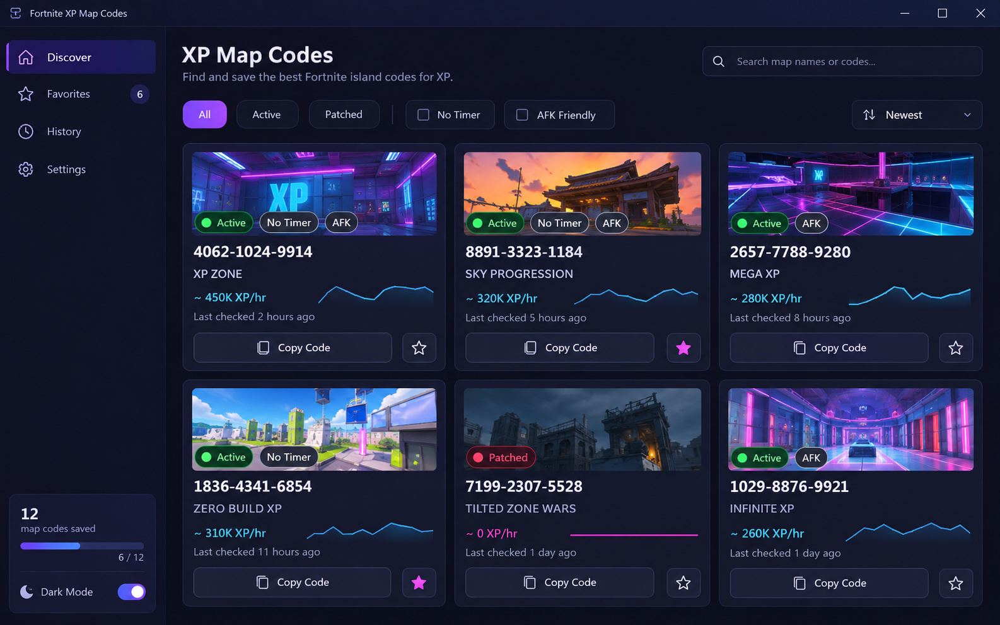

# Fortnite XPマップコード一覧

クリエイティブの島コード、待ち時間、確認日を比較。島に入れることとXP報酬を得られることは別々に確認します。

<a href="./README.md">English</a> · <a href="./README_ES.md">Español</a> · <a href="./README_PT.md">Português</a> · <a href="./README_DE.md">Deutsch</a> · <a href="./README_FR.md">Français</a> · <a href="./README_CN.md">简&#8288;体&#8288;中&#8288;文</a> · <a href="./README_TW.md">繁&#8288;體&#8288;中&#8288;文</a> · <a href="./README_JP.md">日&#8288;本&#8288;語</a> · <a href="./README_KR.md">한&#8288;국&#8288;어</a>

  

## このツールが必要な理由

XP アイランドは、古いコードが流通し続けている間に、名前の変更、無効化、またはパッチを適用することができます。ステータス ボードはすべてのコードの横に最終チェックを配置し、プレイヤーがクリエイティブを起動する前に AFK フローまたはタイマー動作によってリストを絞り込むことができます。

## できること

### 01 · アイランドコードステータスボード

到達可能なコードを、無効またはパッチが適用されたエントリから分離します。

### 02 · ノータイマーフィルターとAFKフィルター

タイマー スタイル、AFK フロー、および最終検証時間によってアイランドをフィルターします。

### 03 · 最後にチェックされたタイムスタンプ

ワンクリックでコードをコピーし、役立つエントリをお気に入りリストに保存します。

## 画面の見方

- **01.** ステータスボードは、アクティブな島、不確実な島、パッチのある島に分割されています。
- **02.** 目的のマップ フロー用のタイマーなしフィルターと AFK フィルター。
- **03.** 作成者、最終チェック、クイックコピーアクションを備えたコードカード。
- **04.** 更新後に再テストする価値のあるコードのお気に入り。
- **05.** 変更または無効化された島のコンパクトなチェック履歴。

## 機能の概要

| 機能 | 結果 |
|---|---|
| **入力** | マップタイプ + ステータスフィルター |
| **結果** | 現在の島コード |
| **出力** | お気に入りとコピーしたコード |

## こんな用途に

- アクティブなマップコードを検索する
- ノータイマーまたはAFKマップをフィルタリングする
- パッチのある島を避ける

## 結果の読み方

ステータスと最終チェック時刻を一緒に読み取る必要があります。 「アクティブ」は記録されたチェック中にコードが機能したことを意味し、「不確実」は島に再度訪問する必要があることを意味します。フィルターは、報告されたマップのフローを記述します。島や報酬は変更される可能性があるため、固定の XP レートを保証するものではありません。

## 開始前の準備

- **マップタイプ + ステータスフィルター** を用意し、対象の Fortnite Creative プロファイルまたはセッションのものか確認します。
- プロファイルを変更する前に、現在のゲーム／クライアントビルドまたはデータ日付を控えます。
- 前回の結果を上書きしないよう、**お気に入りとコピーしたコード** の保存先を決めます。
- まず **アイランドコードステータスボード** を短時間だけ試し、元のセーブ、プロファイル、比較結果を残してください。

## データと復元

コードとステータス履歴はローカル参照データです。最終チェックのラベルは過去のチェックの証拠であり、島が引き続き利用可能であることを保証するものではありません。

自動化や変更機能は、ゲームのルールとセッション形式で許可されている場合にのみ使用してください。

## 初回の一連の流れ

1. **Fortnite XPマップコード一覧** を開き、検出された Fortnite Creative のビルドまたはデータ元を確認します。
2. 入力またはプロファイルを選び、今回のテストに関係しない初期値は変えずに **アイランドコードステータスボード** を設定します。
3. プレビューまたはステータス欄で **ノータイマーフィルターとAFKフィルター** を確認し、バージョン、フィルター、検出の警告を解消します。
4. 操作を一つだけ実行します。二つ目の設定を変える前に、表示結果をプレビューと比較してください。
5. プロファイルまたは結果を保存し、比較や復元に使える **最後にチェックされたタイムスタンプ** を残します。

## ゲーム更新後の確認

- [ ] 最後にチェックした順に並べ替え、古いお気に入りを不確実なステータスに戻します。
- [ ] アイランドはコードを変更せずに変更できるため、コードを個別に開きます。
- [ ] 現在のアイランド フローに対してタイマーと AFK ラベルを再確認します。
- [ ] 無効になったエントリを履歴に保存して、再利用されたコードや誤解を招くコードを認識できるようにします。

## トラブルシューティング

> **よくある不具合:** XP マップ コードが無効になっているかパッチが適用されている.

### コードを入力すると別の島が開きます

作成者と最終チェックの詳細を比較します。再利用されたリストは、変更されたアイランドを指す場合があります。

### アクティブなコードは機能しなくなります

不確実な状態に移動し、チェック時間を維持します。島の空き状況は予告なく変更される場合があります。

### リストが古く感じられる

古いエントリを参照する前に、最後にチェックした順に並べ替え、保存したお気に入りを再テストします。

## よくある質問

<strong>アクティブコードとは何を意味しますか?</strong>

アクティブは、表示されたチェック時間にアイランド コードに到達可能であったことを意味します。作成者は後でマップを無効にしたり変更したりできるため、タイムスタンプは重要です。

<strong>対応情報には何を記録しますか？</strong>

正確なゲームビルド、ツール・データの版、入力、観測結果を残してください。不明な項目は不明のまま記録します。画像や別バージョンでの成功は現在の対応を証明しません。

<strong>動作するプログラムやスクリプトは含まれますか？</strong>

現在のリポジトリは文書と画面のコンセプトを収録しており、動作するリリースは未確認です。説明や画像は実行テストでも、公式性・対応版・アカウント保護の証明でもありません。

---

## ダウンロード

バージョンを選ぶ前に、記載された対象範囲と対応状況を確認してください。

---

AIで生成したインターフェースのコンセプト画像です。動作するリリースは未確認です。

